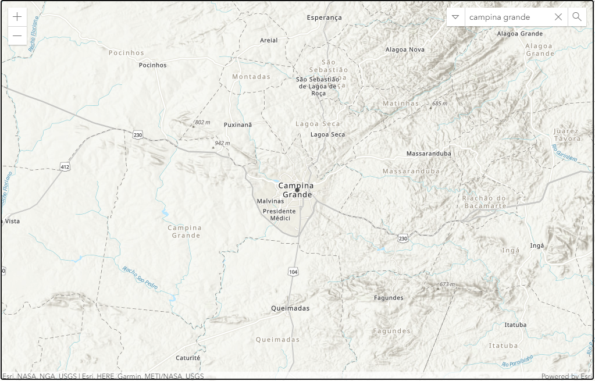

## Search location with api arcgis



## Getting Started

- Clone the repo and cd into the directory

```bash
$ git clone git@github.com:maximanoLeite/Search-locate-with-arcgis.git
$ cd Search-locate-with-arcgis
```

- Install eel and pyinstaller

```sh
$ pip install eel pyinstaller
```

- Run the app

```sh
$ python main.py
```

## Packaging the app

You can pass any valid `pyinstaller` flag in the following command to further customize the way your app is built.

```sh
$ python -m eel main.py web --noconsole --onefile --icon=icon.ico
```
